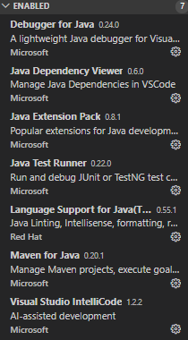
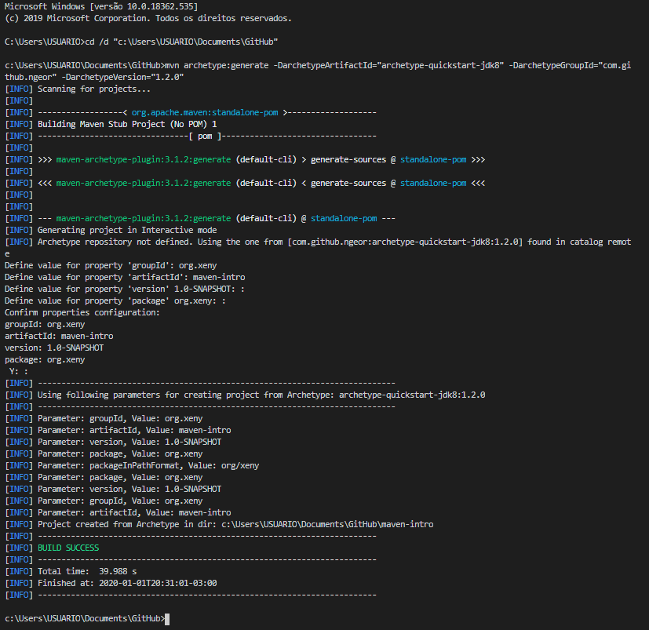
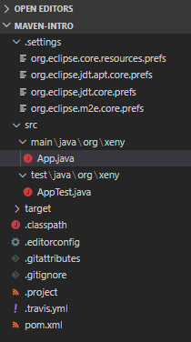
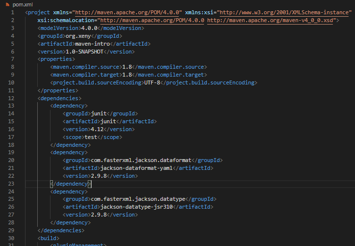
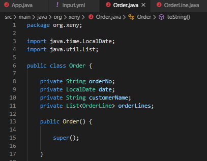
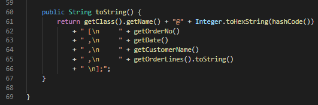
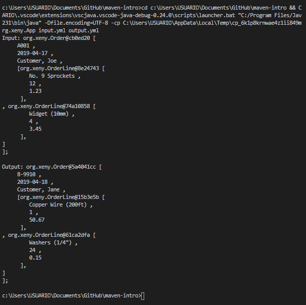
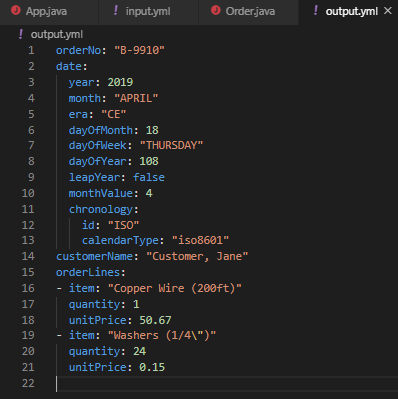

# Maven Introduction

As I'm moving into a new internship, and hopefully closer to my dream career as a game developer and eclectic software enthusiast, I need to both set myself up for the new challenge, starting with the basics. Enter Maven.

My goal for the following days is to understand the necessary setup to open and create a Maven based Java project on VSCode and compile it. To do so, I plan on rebuilding my challenge project that I've built to be admitted in this new job opportunity, of which - funny story - I opted at the time to build without Maven and took me days to get around compiling something that a Maven library can solve in few lines of code and, to the dismay of my past self, is pretty easy to setup in essence.

Let it be of notice though: I *hate* how you need restarts to setup PATHs on Windows, apparently. After having a hard time figuring what I needed to do in order to use Visual Code to create a Java Project - and yes, it is my editor of preference for any project as it stands right now, it used to be worse with Sublime Text being my jack of all trades, but hey, this is a tangent for another day -, it also took me a while to realize all I never to put PATH changes into effect was a restart. The 'mother of all solutions' for a system configuration problem, makes sense, but I wish I wasn't so naive at these things still.

Either way, opening a Maven-Java project on VS Code is fairly simple - a process I'll describe so I can look at this a few days later so to start my new job with the right foot! -, after installing JDK and Maven on my rig, setting up its PATHs on the system and installing all extentions needed for this project model, it was just a matter of calling the 'Ctrl+P' Quick Open on VS Code and run 'Maven: Create Maven Project' for a simple template app. I choose the 'quickstart-jdk8' archetype as well, for that matter.

*These are the extentions by the way - most of which provided by the VS Code auto-pilot, I'll admit.*

*Command prompt that opened after running the 'Create Maven Project' command. Noticed I've entered some generic values for 'groupId' (paying attention as it'll serve as a Java package) and 'artifactId' (the project name).*

*The files created for the project. Subsequently a bin folder will show up with the codes as we compile our code.*

Alright, Java template setup, now it's time to work the Maven half of the deal. Firstly, we add the dependencies to be used in the project into the ´pom.xml´ file at the root of the project. I choose Jackson for this, since it seems to be the standard for YAML file manipulation. Copy and paste the dependency elements into the ´pom.xml´ file and it's all set!

*Dependencies added to the project, in the pom.xml file.**

Now it's just a matter of testing if it's all working. I took the liberty to just take the example from the Baeldung page for now, as this setting up process took me quite a while - both learning Maven itself, but also taking notes from it all. 

For the classes, I had to, along with making new files for them and making constructors, getters and setters, also build a default constructor that redirects to the proper constructor we have build, as a work around for an InvalidDefinitionException error I was getting. No clue yet as to why, but I won't question it, at least not until Monday. I also took the liberty of making custom toString method for fancier console printing, why not. 

The app itself, otherwise, didn't require much tinkering, just importing the proper libraries and it all worked like a charm... except for the small caviat that the output.yml file prints the date object by its components and not a friendly format like expected with the input.yml formatting. Not that it matters though, the project met its goals, Maven runs the app using its libraries to fulfill its programming. Just not as expected.

*Maven demanded a sacrifice, so I offered the default constructor it wanted.v

*Custom toString, because I love console prints still.*

*Final result on console, working like a charm!*

*The output.yml file, with the oddity of shaping the date by its components and not a friendly format.*

Had I had the extra time to crack this egg open for my job application, and had I known that it wasn't so much of a hussle as it seems, I'd have used it to boost my current display of skills and learning capabilities, but lo-and-behold, I was admitted either way, so all's well that ends well, right? Nope! Always strive to overachieve if you got the room to do so, and here am I, getting a nice foothold of the technical side of this new challenge before it begins. And if I could wrap my head around this, I believe anyone can. May take some basics of Java, of course, but besides that, it's just a matter of searching, learning and experimenting with the technology.
